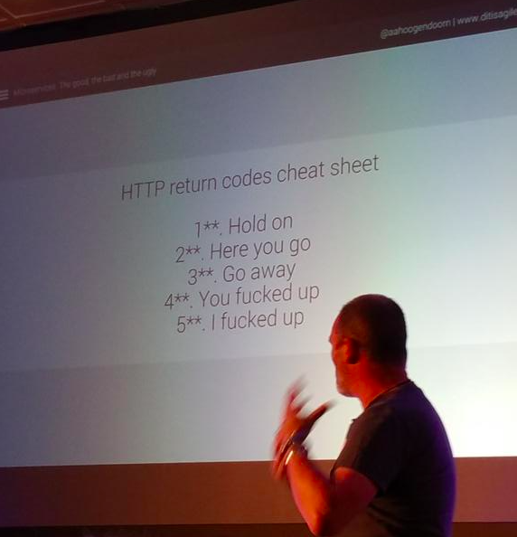

# REST API (Representational State Transfer)

---

# What is an API?

- Singkatan dari Application Programming Interface.
- Merupakan seperangkat aturan dan protokol yang memungkinkan aplikasi perangkat lunak yang berbeda untuk berkomunikasi dan berinteraksi satu sama lain.

> Interface (antarmuka): adalah titik interaksi antara dua sistem, tempat informasi atau sinyal dipertukarkan.

> Protokol: aturan yang mengatur komunikasi antar komputer, mesin, atau perangkat (perangkat lunak dan perangkat keras).

---

# Examples of APIs

- Operating System APIs
- Database APIs
- Library APIs
- Web APIs (HTTP/HTTPS)

---

# Examples of APIs

**Operating System APIs:** APIs that allow applications to interact with the OS.

- Win32 API (Windows)
- Cocoa API (macOS)
- Android API (Android)
- iOS API (iOS)

---

# Examples of APIs

```swift
// iOS
let alert = UIAlertController(
  title: "Hello",
  message: "Hello, world!",
  preferredStyle: .alert
)

alert.addAction(UIAlertAction(title: "OK", style: .default, handler: nil))

present(alert, animated: true, completion: nil)
```

> `UIAlertController` is an iOS API that provides an API for displaying alerts.

---

# Examples of APIs

**Database APIs:** APIs for database management and queries.

- JDBC (Java Database Connectivity)
- ODBC (Open Database Connectivity)
- ADO.NET (ActiveX Data Objects for .NET)
- PDO (PHP Data Objects)
- Hibernate (Java)

---

# Examples of APIs

```php
// PHP
$pdo = new PDO('mysql:host=localhost;dbname=example', 'root', 'password');

$product = $pdo->query('SELECT * FROM products WHERE id = 1')->fetch();
echo $product['name'];
```

> `PDO` is a PHP API that provides an API for interacting with databases.

---

# Examples of APIs

**Library APIs:** APIs provided by programming libraries or frameworks.

```js
// Node.js
const fs = require('fs')

fs.readFile('file.txt', (err, data) => {
  if (err) throw err
  console.log(data)
})
```

> `fs` is a Node.js module that provides an API for interacting with the file system.

---

# Examples of APIs

**Web APIs (HTTP/HTTPS):** APIs that use HTTP/HTTPS protocols to communicate over the web.

- OpenWeatherMap (https://openweathermap.org/api)
- Google Maps API (https://developers.google.com/maps)
- GitHub API (https://developer.github.com/v3/)

---

# Why APIs Matter

- Memungkinkan integrasi antara sistem/perangkat lunak yang berbeda.
- Memungkinkan pertukaran data.
- Memungkinkan berbagi-pakai fungsi.
- Modular dan skalabel dalam pengembangan perangkat lunak.

---

# Web API: Client-Server Architecture

Arsitektur client-server adalah model komputasi yang membagi tugas antara dua komponen: client dan server.

- Client adalah perangkat atau aplikasi yang meminta layanan atau data.
- Server adalah perangkat atau aplikasi yang menyediakan layanan atau data.

---

# Web API: Client-Server Architecture

Arsitektur client-server memiliki beberapa keuntungan, antara lain:

- **Pemisahan tugas:** Client dan server dapat fokus pada tugas masing-masing, sehingga dapat meningkatkan kinerja dan efisiensi.
- **Skalabilitas:** Server dapat melayani banyak client secara bersamaan, sehingga dapat mendukung aplikasi yang digunakan oleh banyak orang.
- **Interoperabilitas:** Client dan server dapat berkomunikasi melalui protokol standar yang dikenali secara luas, sehingga dapat mendukung sistem yang berbeda.

---

# Web API: Client-Server Architecture

**Contoh arsitektur client-server**

- Dalam konteks pengembangan aplikasi web, arsitektur client-server sering digunakan untuk membangun aplikasi berbasis web.
- Client dapat berupa aplikasi web, aplikasi seluler, atau perangkat keras yang terhubung ke jaringan.
- Server dapat berupa server web, server basis data, atau server aplikasi yang menyediakan layanan atau data yang diminta oleh client.

---

# Web API: Client-Server Architecture

**Contoh arsitektur client-server dalam kehidupan sehari-hari:**

- Saat menggunakan peramban untuk membuka situs web, peramban adalah client yang meminta halaman web dari server web.
- Saat mengirim email, aplikasi email adalah client yang mengirimkan email ke server email.
- Saat menggunakan aplikasi seluler untuk memesan makanan, aplikasi seluler adalah client yang mengirimkan pesanan ke server aplikasi.

---

# Web APIs

Secara historikal, Web API dibangun menggunakan dua pendekatan yang berbeda:

- SOAP (Simple Object Access Protocol)
- REST (Representational State Transfer)

Namun saat ini ada beberapa pendekatan lain yang juga digunakan, di antaranya:

- GraphQL
- gRPC (g stands for Google, Remote Procedure Call)

---

# Web API: SOAP

SOAP adalah protokol komunikasi yang digunakan untuk mengirim dan menerima pesan-pesan yang berisi informasi terstruktur.

```xml
<soap:Envelope
  xmlns:soap="http://www.w3.org/2003/05/soap-envelope"
  xmlns:ws="http://www.example.org/stock">
  <soap:Header/>
  <soap:Body>
    <ws:GetStockPrice>
      <ws:StockName>IBM</ws:StockName>
    </ws:GetStockPrice>
  </soap:Body>
</soap:Envelope>
```

---

# Web API: SOAP

```bash
curl -X POST \
  http://www.example.org/stock \
  -H 'Content-Type: application/soap+xml' \
  -d '<soap:Envelope
  xmlns:soap="http://www.w3.org/2003/05/soap-envelope"
  xmlns:ws="http://www.example.org/stock">
  <soap:Header/>
  <soap:Body>
    <ws:GetStockPrice>
      <ws:StockName>IBM</ws:StockName>
    </ws:GetStockPrice>
  </soap:Body>
</soap:Envelope>'
```

---

# Web API: SOAP

SOAP kini jarang digunakan karena:

- Kompleksitas: SOAP memiliki banyak spesifikasi dan aturan yang rumit.
- Performa: SOAP menggunakan XML yang memiliki ukuran yang besar.
- Perannya digantikan oleh REST API.

---

# REST API?

- REST adalah singkatan dari Representational State Transfer.
- REST API berfokus pada sumber daya (resources) dan bagaimana sumber daya diakses melalui permintaan HTTP.

> HTTP: Hypertext Transfer Protocol adalah protokol komunikasi yang digunakan untuk mentransfer data melalui jaringan komputer.

---

# HTTP Request and Response

- HTTP (Hypertext Transfer Protocol) adalah protokol dasar yang mengatur komunikasi antara client web (seperti browser) dan server web.

- Protokol ini beroperasi pada siklus permintaan dari client dan respons dari server.

---

# Request-Response Cycle

1. Klien Memulai Permintaan
2. Server Memproses Permintaan
3. Server Mengirim Respons
4. Klien Menerima Respons

---

# Request-Response Cycle

**1. Klien Memulai Permintaan:**

- Mengirim permintaan ke server
- Mengandung metode (GET, POST, dll.), URL, header, dan body (opsional)

**2. Server Memproses Permintaan:**

- Menganalisis permintaan
- Menentukan tindakan yang diperlukan
- Mengakses database, menghasilkan konten, atau mengambil file

---

# Request-Response Cycle

**3. Server Mengirim Respons:**

- Membangun pesan respons
- Mengandung kode status, header, dan body (opsional)

**4. Klien Menerima Respons:**

- Menginterpretasikan respons
- Menampilkan konten atau menangani kesalahan

---

# HTTP Request

Permintaan HTTP terdiri dari beberapa elemen, termasuk:

- **Method**: Jenis tindakan yang diminta (`GET`, `POST`, `PUT`, `PATCH` `DELETE`).
- **URL**: Alamat sumber daya yang diminta.
- **Header**: Informasi tambahan seperti jenis konten atau cookie.
- **Body**: Data opsional yang dikirim bersama permintaan.

---

# HTTP Response

Respons HTTP juga memiliki elemen-elemen penting, termasuk:

- **Status Code**: Kode numerik yang mengindikasikan apakah respons berhasil atau ada masalah.
- **Header**: Informasi tambahan dari server.
- **Body**: Konten yang dikirimkan kembali kepada client.

---

# HTTP Status Code

HTTP status code dapat dibagi menjadi 5 kategori:

- 1xx: Informasi
- 2xx: Sukses
- 3xx: Pengalihan
- 4xx: Kesalahan Klien
- 5xx: Kesalahan Server

Referensi:

- https://http.cat/
- https://httpstatuses.io/

---



---

# REST API: Basics

1. **Resources**: Semua konsep adalah sumber daya, misalnya data, gambar, teks, atau layanan.

2. **Operasi pada Sumber Daya**: Sumber daya dapat diakses, dibaca, diperbarui, atau dihapus menggunakan operasi standar HTTP.

3. **Representasi**: Sumber daya direpresentasikan dalam format tertentu, seperti JSON atau XML.

4. **Stateless**: Setiap permintaan dari client ke server harus mengandung semua informasi yang diperlukan untuk memahami permintaan tersebut. Server tidak menyimpan status client antara permintaan sebelumnya dan permintaan berikutnya.

---

# REST API: Resources

Dalam REST API, sumber daya dapat berupa apa saja yang dapat diidentifikasi dan didefinisikan, seperti:

- Produk dalam toko online
- Posting blog
- Profil pengguna
- Layanan peramalan cuaca
- Dan banyak lagi...

---

# REST API: Operations

REST API menggunakan operasi standar HTTP seperti:

- `GET` untuk membaca sumber daya.
- `POST` untuk membuat sumber daya baru.
- `PUT` atau `PATCH` untuk memperbarui sumber daya yang ada.
- `DELETE` untuk menghapus sumber daya.

---

# REST API: Resources, URL, and Methods

| Sumber Daya     | Metode HTTP        | URL                 |
| --------------- | ------------------ | ------------------- |
| Daftar Produk   | `GET`              | `/api/products`     |
| Detail Produk   | `GET`              | `/api/products/123` |
| Tambah Produk   | `POST`             | `/api/products`     |
| Perbarui Produk | `PUT` atau `PATCH` | `/api/products/123` |
| Hapus Produk    | `DELETE`           | `/api/products/123` |

---

# REST API: Resource Representation

- Representasi sumber daya dalam REST API umumnya menggunakan format data seperti JSON atau XML.
- Ini memungkinkan client dan server untuk berkomunikasi dengan format yang sama.

---

# REST API: Resource Representation

**Format XML**

```xml
<user>
  <id>123</id>
  <name>John Doe</name>
  <email>john.doe@example.com</email>
</user>
```

**Format JSON**

```json
{
  "id": 123,
  "name": "John Doe",
  "email": "john.doe@example.com"
}
```

---

# REST API: Benefits

- Kesederhanaan: Memahami konsep REST API relatif mudah.
- Keterbukaan: Format data umum memudahkan integrasi dengan berbagai platform.
- Fleksibilitas: REST API dapat digunakan dengan berbagai bahasa pemrograman.
- Dukungan: REST API didukung oleh banyak library dan framework.

---

# Other Types of Web APIs

- GraphQL
- gRPC
