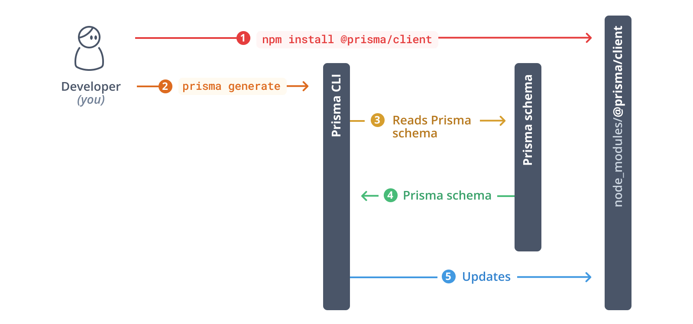

# Integrasi Prisma ORM dengan Express.js

---

# Installasi

```bash
mkdir my-express-app
cd my-express-app
npm init -y
npm install express

npm install prisma --save-dev
npx prisma init

# specific database
npx prisma init --datasource-provider=mysql
```

> Prisma CLI documentation:
> https://www.prisma.io/docs/orm/reference/prisma-cli-reference

---

# Core Concepts

- Prisma Client
- Prisma Schema
- Prisma Migrate

> Prisma dapat digunakan pada database yang sudah ada maupun database yang baru dibuat.

---

# Prisma Client

- Prisma Client adalah _query builder_ yang dibuat secara otomatis berdasarkan Prisma Schema.
- Prisma Client memungkinkan kita untuk berinteraksi dengan database menggunakan objek dan metode, bukan SQL langsung.
- Prisma Client dapat digunakan di mana saja, termasuk di Express.js.

> Query builder adalah _library_ yang memungkinkan kita untuk membuat _query_ database menggunakan objek dan metode, bukan SQL langsung.

---

# Prisma Schema

- Prisma Schema adalah file yang mendefinisikan model data dan sumber data.
- Model data mendefinisikan struktur data yang akan disimpan di database.
- Sumber data (datasource) mendefinisikan database yang akan digunakan.
- Prisma Schema ditulis dalam bahasa Prisma Schema Language (PSL).

> Model adalah representasi struktur data yang akan disimpan di database.

---

# Prisma Migrate

- Prisma Migrate adalah _schema migration tool_ yang memungkinkan kita untuk mengubah struktur database secara deklaratif.
- Prisma Migrate dapat digunakan untuk mengubah struktur database di environment development dan production.
- Prisma Migrate dapat digunakan di mana saja, termasuk di Express.js.

> Migrasi adalah proses untuk mengubah struktur database.

---

# Prisma Schema Language (PSL)

- Prisma Schema Language (PSL) adalah bahasa yang digunakan untuk menulis Prisma Schema.
- PSL memiliki sintaks yang mirip dengan JavaScript.
- PSL memiliki beberapa _keyword_ yang digunakan untuk mendefinisikan model data dan sumber data.

> Dokumentasi PSL:
> https://www.prisma.io/docs/orm/prisma-schema/

---

# Prisma Schema Language (PSL)

```prisma
generator client {
  provider = "prisma-client-js"
}

datasource db {
  provider = "mysql"
  url      = env("DATABASE_URL")
}
```

- `generator`: Mendefinisikan Prisma Client.
- `datasource`: Mendefinisikan sumber data.

---

# Prisma Schema Language (PSL)

```prisma
model Product {
  id          Int      @id @default(autoincrement())
  name        String
  category    String
  price       Float
  in_stock    Boolean
  description String?
  created_at  DateTime @default(now())
}
```

- `model`: Mendefinisikan model data (struktur data).

---

# Generate Prisma Client

```bash
npx prisma generate
```

- Perintah ini akan membuat folder `node_modules/.prisma/client` yang berisi Prisma Client.
- Prisma Client dapat digunakan untuk berinteraksi dengan database.

---

# Prisma Client

```js
import { PrismaClient } from '@prisma/client'

const prisma = new PrismaClient()

app.get('/products', async (req, res) => {
  const products = await prisma.product.findMany()
  res.json(products)
})
```

---

# Prisma Client

```js
import { PrismaClient } from '@prisma/client'

const prisma = new PrismaClient()

app.get('/products/:id', async (req, res) => {
  const { id } = req.params
  const product = await prisma.product.findUnique({
    where: { id: Number(id) },
  })

  product ? res.json(product) : res.status(404).json({ error: 'Not found' })
})
```

---



---

# Prisma Schema

**Konvensi Penamaan Model**

- Nama model harus dimulai dengan huruf dan menggunakan format PascalCase (misalnya, `User`, `Product`).
- Nama model harus berbentuk tunggal (`User`, bukan `Users` atau `user`).
- Nama model hanya boleh menggunakan huruf, angka, dan underscore (\_).
- Hindari menggunakan [_reserved keywords_](https://github.com/prisma/prisma/blob/main/packages/client/src/generation/generateClient.ts#L376).

> Menggunakan atribut `@@map` untuk memetakan model ke tabel dengan nama berbeda yang tidak mengikuti konvensi penamaan model (misalnya, `@@map("products")` untuk model `Product`).

---

# Prisma Schema

Setiap model harus memiliki unique identifier (primary key).

- `@id`: Mendefinisikan field sebagai primary key.
- `@@id`: Mendefinisikan field sebagai composite primary key.
- `@unique`: Mendefinisikan field sebagai unique key.
- `@@unique`: Mendefinisikan field sebagai composite unique key.

---

# Prisma Schema

**Model Field**: merupakan _property_ dari model yang mendefinisikan struktur data.

- Scalar: field yang menyimpan data tunggal (misalnya, `String`, `Int`, `Boolean`, `Float`, `DateTime`).
- Modifier:
  - `?` membuat field menjadi opsional (`String?`).
  - `[]` membuat field menjadi list (`String[]`), .

> `[]` only supported by PostgreSQL and CockroachDB

> https://www.prisma.io/docs/orm/reference/prisma-schema-reference#model-field-scalar-types

---

# Prisma Schema

**Konvensi Penamaan Field**

- **Format**: Gunakan format `camelCase` untuk field Anda, seperti `firstName`, `createdAt`, atau `isVerified`.
- **Huruf Besar/Kecil**: Awali nama field dengan huruf (bukan garis bawah) dan gunakan huruf kecil untuk kata berikutnya.
- **Karakter Diizinkan**: Gunakan kombinasi huruf, angka, dan garis bawah (\_).

---

# Prisma Schema

**Good:**

- `userId`
- `productDescription`
- `isPublished`

**Bad:**

- `_id` (disarankan menggunakan `id` sebagai gantinya)
- `firstName1` (hindari penomoran tambahan)
- `user-age` (gunakan camelCase)

> Menerapkan konvensi penamaan field memastikan maintainablity kode Prisma, gunakan atribut `@map` untuk penyesuaian jika diperlukan.

---

# Prisma Schema

**Attributes**: memodifikasi behavior dari model field atau model secara keseluruhan.

- `@id`, `@@id`: Mendefinisikan field sebagai primary key.
- `@default`, `@@default`: Mendefinisikan nilai default untuk field.
- `@unique`, `@@unique`: Mendefinisikan field sebagai unique key.
- `@index`, `@@index`: Mendefinisikan field sebagai index.
- `@relation`: Mendefinisikan relasi antar model.
- `@map`, `@@map`: Mendefinisikan nama field atau model yang berbeda dengan nama default.
- `@updatedAt`: Mendefinisikan field sebagai timestamp yang menandakan waktu terakhir field diubah.

> https://www.prisma.io/docs/orm/reference/prisma-schema-reference#attributes

---

# Prisma Schema

**Attribute Functions**

- `autoincrement()`: Mendefinisikan nilai default untuk field dengan nilai autoincrement.
- `now()`: Mendefinisikan nilai default untuk field dengan nilai timestamp saat ini.
- `uuid()`: Mendefinisikan nilai default untuk field dengan nilai UUID v4.
- `dbgenerated()`: Mendefinisikan nilai default untuk field dengan nilai yang dihasilkan oleh database.

---

# Prisma Schema Relations

Prisma mendukung definisi hubungan antar model:

- **1:1:** Satu entitas di model A terhubung dengan 1 entitas di model B (misal: User dan Profile).
- **1:N:** Satu entitas di model A terhubung dengan banyak entitas di model B (misal: User dan Post).
- **N:N:** Banyak entitas di model A terhubung dengan banyak entitas di model B (misal: Post dan Category).

---

# Prisma Schema Relations

```prisma
model User {
  id        Int      @id @default(autoincrement())
  name      String
  email     String   @unique
  posts     Post[]
  profile   Profile?
}

model Profile {
  id        Int     @id @default(autoincrement())
  bio       String?
  user      User    @relation(fields: [userId], references: [id])
  userId    Int     @unique
}
```

---

# Prisma Schema Relations

```prisma
model Post {
  id        Int      @id @default(autoincrement())
  title     String
  content   String?
  published Boolean
  author    User     @relation(fields: [authorId], references: [id])
  authorId  Int
  categories Category[]
}

model Category {
  id        Int      @id @default(autoincrement())
  name      String
  posts     Post[]
}

```

---

# Database Migration

- Migrasi database adalah serangkaian perubahan terkontrol yang mengubah dan mengembangkan struktur skema database.

- Migrasi membantu mengubah skema database dari satu keadaan ke keadaan lainnya. Misalnya:
  - Membuat atau menghapus tabel dan kolom
  - Menambahkan type dan constraint ke database

---

# Database Migration

Pola-pola untuk mengembangkan skema database, terdapat 2 pola yang umum digunakan:

- Pendekatan Entity First (Model First)
- Pendekatan Database First

---

# Database Migration

**Pendekatan Entity First (Model First)**

- Pola ini dimulai dengan definisi struktur skema database.
- Selanjutnya, _migration tool_ digunakan untuk menghasilkan SQL yang kemudian disinkronkan dengan skema aplikasi dan database.

---

## 

---

# Database Migration

**Pendekatan Database First**

- Pola ini dimulai dengan definisi struktur database dan penerapannya menggunakan SQL.
- Kemudian dilakukan _introspection_ (pemeriksaan) database untuk menghasilkan kode yang menggambarkan strukturnya untuk sinkronisasi skema aplikasi dan database.

---


---

# Prisma Migrate

Prisma Migrate adalah database migration tools yang menerapkan pola migrasi **model/entitas first**.

Tools ini membantu dalam mengelola skema database baik di environment local maupun production.

---

# Prisma Migrate

- **Deklaratif:** skema database didefinisikan dalam **Prisma Schema**, format deklaratif yang mudah dibaca.
- **Migrasi Otomatis:** Prisma Migrate secara otomatis menghasilkan file migrasi SQL berdasarkan perubahan pada Prisma Schema.
- **Kontrol Penuh:** Prisma Migrate memungkinkan kita untuk mengontrol migrasi database secara penuh, yang dapat disesuaikan sesuai kebutuhan.
- **Kolaborasi Mudah:** Prisma Migrate memungkinkan kita untuk berkolaborasi dengan tim dalam mengelola skema database dengan lebih mudah.

---

# Prisma Migrate

Prisma Migrate melacak status skema database melalui:

- **Skema Prisma:** _Source of truth_ yang menggambarkan struktur skema database.
- **Riwayat Migrasi:** Berupa file-file SQL tersimpan di folder `prisma/migrations`, yang mewakili perubahan historikal yang telah dilakukan pada skema database.
- **Tabel Migrasi:** Tabel `_prisma_migrations` di dalam database yang menyimpan metadata terkait migrasi yang telah diterapkan ke database.
- **Skema Database:** Kondisi aktual dari struktur database Anda.

---


---

# Prisma Migrate

Ketika menjalankan perintah migrasi `prisma migrate dev`, Prisma Migrate akan melakukan hal-hal berikut:

- Memeriksa riwayat migrasi untuk melihat migrasi mana yang telah diterapkan.
- Membaca tabel migrasi untuk memastikan migrasi yang ditandai telah diterapkan benar-benar ada di database.
- Membandingkan skema Prisma Anda dengan skema database saat ini untuk mendeteksi perbedaan.
- Jika ada perbedaan, Prisma Migrate akan menerapkan migrasi yang diperlukan untuk menyelaraskan skema database dengan skema Prisma Anda.

Dengan menggunakan pendekatan ini, Prisma Migrate memastikan bahwa skema database Anda selalu konsisten dengan definisi skema dalam kode Anda.

---


---

# Prisma Migrate

Perlu dicermati:

- Pertama kali menjalankan perintah migrasi `prisma migrate dev`, Prisma Migrate akan membuat tabel migrasi `_prisma_migrations` di dalam database serta folder `prisma/migrations` yang berisi file migrasi SQL.
- Jika sudah ada definisi model di dalam skema Prisma, Prisma Migrate akan menghasilkan file migrasi SQL awal yang mewakili struktur model tersebut.
- Jika ada perbedaan antara skema Prisma dan skema database, Prisma Migrate akan menghasilkan file migrasi SQL yang diperlukan untuk menyelaraskan skema database dengan skema Prisma.
- Jika tidak ada perbedaan antara skema Prisma dan skema database, Prisma Migrate tidak akan melakukan apa-apa.
