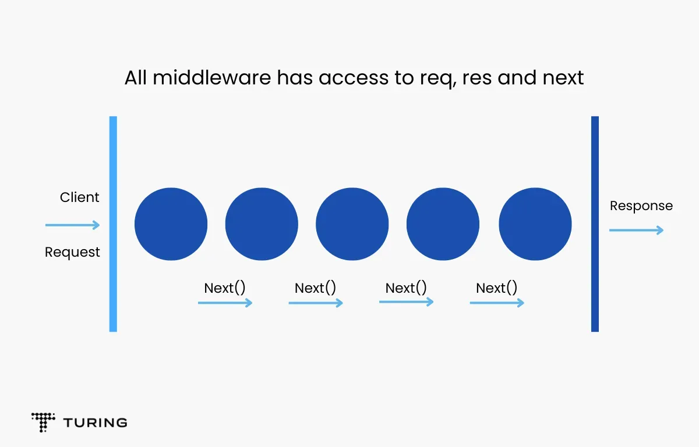

# Express.js

---

# Express.js

- Express.js adalah framework Node.js yang ringan dan fleksibel.
- Seringkali digunakan untuk membangun aplikasi web dan RESTful API dengan mudah.
- Menyediakan berbagai fitur yang memudahkan pembuatan aplikasi web.
- Mendukung implementasi berbagai _middleware_ yang dapat digunakan untuk berbagai keperluan.
- Dapat digunakan bersama dengan berbagai _template engine_.

---

# Installation

```bash
mkdir try-express

cd try-express

npm init -y

npm install express
```

---

# Hello World

```javascript
const express = require("express");
const app = express();
const port = 3000;

app.get("/", (req, res) => {
  res.send("Hello, World!");
});

app.listen(port, () => {
  console.log(`🚀️ on port ${port}`);
});
```

---

# Routing dalam Express.js

- Routing merujuk pada cara sebuah aplikasi menanggapi permintaan klien pada resource tertentu dan metode permintaan HTTP tertentu (GET, POST, dan lainnya).
- Setiap rute dapat memiliki satu atau lebih fungsi penangan, yang dieksekusi ketika rute cocok.

Referensi:
https://expressjs.com/en/starter/basic-routing.html

---

# Routing

Definisi rute memiliki struktur berikut:

```javascript
app.METHOD(PATH, HANDLER);
```

- `app` adalah instance dari express.
- `METHOD` adalah metode permintaan HTTP, dalam huruf kecil.
- `PATH` adalah path di server.
- `HANDLER` adalah fungsi yang dieksekusi ketika rute cocok.

---

# Routing

```javascript
app.get("/about", (req, res) => {
  res.send("Halaman Tentang Kami");
});

app.get("/contact", (req, res) => {
  res.send("Hubungi Kami");
});
```

---

# Simple API

```javascript
const express = require("express");
const app = express();
app.use(express.json());
require("dotenv").config();

const port = process.env.PORT || 3000;

const products = [
  { id: 1, name: "Product A" },
  { id: 2, name: "Product B" },
  { id: 3, name: "Product C" },
];

app.get("/products", (req, res) => {
  res.json(products);
});

app.listen(port, () => {
  console.log(`🚀️ on port ${port}`);
});
```

---

# Simple API

```javascript
app.post("/products", (req, res) => {
  const newProduct = req.body;

  newProduct.id = products.length + 1;

  while (products.find((p) => p.id === newProduct.id)) {
    newProduct.id++;
  }

  products.push(newProduct);

  res.status(201).json(newProduct);
});
```

---

# Middleware dalam Express.js

- Middleware adalah fungsi-fungsi yang dipanggil oleh Express.js sebelum menangani permintaan utama.
- Middleware berperan sebagai perantara antara permintaan klien dan respons server.

Referensi:
https://expressjs.com/en/guide/using-middleware.html
https://www.turing.com/kb/building-middleware-for-node-js

---



---

# Mengapa Middleware?

Middleware digunakan untuk melakukan berbagai tugas, seperti:

- Otentikasi: Memverifikasi identitas pengguna.
- Logging: Merekam informasi tentang permintaan.
- Validasi: Memeriksa data yang diterima dari klien.
- Dan banyak lagi...

---

# Urutan Middleware

- Middleware dapat disusun dalam urutan tertentu.
- Setiap middleware akan dipanggil satu per satu sesuai urutan mereka ditentukan dalam aplikasi Express.

```javascript
app.use(middleware1);
app.use(middleware2);
app.use(middleware3);
```

---

# Middleware

```javascript
// middleware 1
app.use((req, res, next) => {
  console.log("Time:", Date.now());
  next();
});

// middleware 2
function loggerMiddleware(req, res, next) {
  console.log(`Permintaan ke: ${req.method} ${req.url}`);
  next(); // Lanjutkan ke middleware atau penanganan berikutnya.
}

app.use(loggerMiddleware);
```

---

# Template Engine

- Express.js mendukung berbagai mesin templating seperti Pug, EJS, dan Handlebars.
- Templating memungkinkan Anda membuat tampilan dinamis dalam aplikasi web Anda.

---

# Template Engine

```bash
npm install pug --save
npm install ejs --save
npm install express-handlebars --save
```

```javascript
app.set("view engine", "ejs");

app.set("views", __dirname + "/views");

app.get("/profile", (req, res) => {
  res.render("profile", { nama: "John Doe" });
});
```

---

# Template Engine Pug

```pug
html
  head
    title Profil
  body
    h1 Profil
    p Nama: #{nama}
```

https://pugjs.org/api/getting-started.html

---

# Template Engine EJS

```html
<html>
  <head>
    <title>Profil</title>
  </head>
  <body>
    <h1>Profil</h1>
    <p>Nama: <%= nama %></p>
  </body>
</html>
```

https://ejs.co/

---

# Template Engine Handlebars

```html
<html>
  <head>
    <title>Profil</title>
  </head>
  <body>
    <h1>Profil</h1>
    <p>Nama: {{ nama }}</p>
  </body>
</html>
```

https://handlebarsjs.com/
