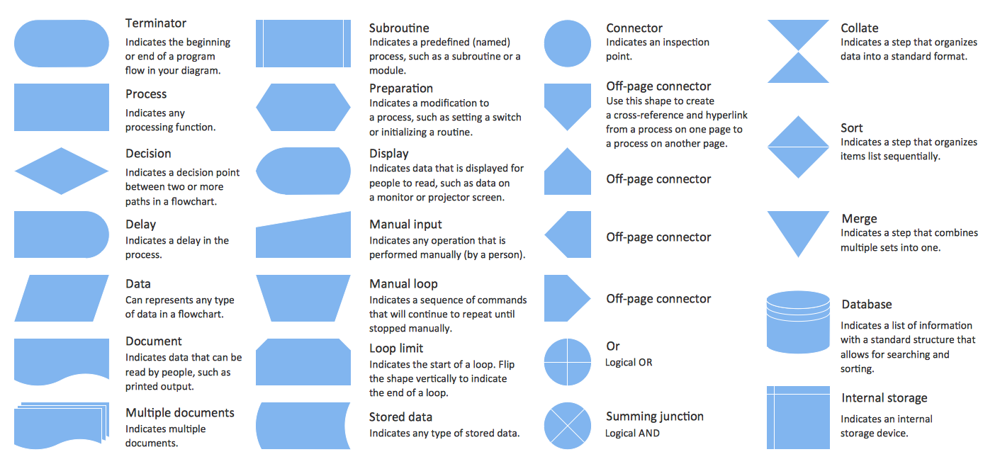
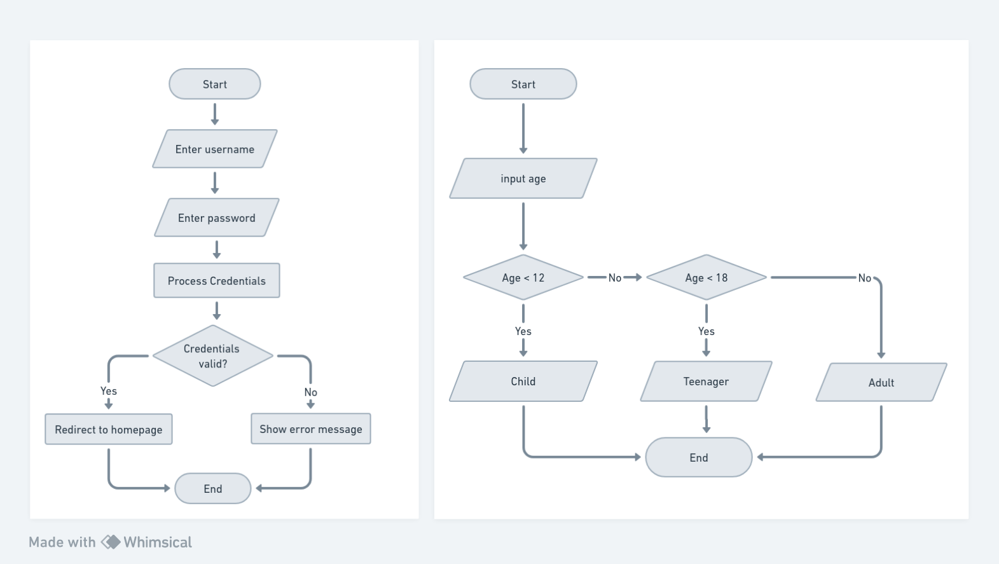

# Visualisasi Proses Menggunakan Flowchart

---

# Apa Itu Flowchart?

- **Flowchart** adalah alat visual yang digunakan untuk menggambarkan langkah-langkah dalam suatu proses.
- Flowchart memungkinkan visualisasi yang jelas dan pemahaman yang mudah terhadap bagaimana suatu proses berjalan.

---

# Keuntungan Penggunaan Flowchart

- **Kemudahan Pemahaman**: Flowchart membantu orang untuk lebih mudah memahami proses yang sedang dijelaskan.
- **Dokumentasi**: Membantu dalam mendokumentasikan dan merancang proses.
- **Kerangka Kerja**: Memberikan kerangka kerja dalam perancangan perangkat lunak.

---

# Simbol-simbol Flowchart

- Flowchart menggunakan simbol-simbol khusus untuk merepresentasikan tindakan, pengujian, keputusan, dan sebagainya.
- Beberapa contoh simbol meliputi kotak, panah, berlian, dan elips.

---

---

# Elemen Penting dalam Sebuah Flowchart

Flowchart mengandung beberapa elemen kunci yang digunakan untuk menggambarkan proses dengan jelas. Elemen-elemen ini termasuk:

1. **Terminator**: Menggambarkan awal atau akhir dari suatu proses.
2. **Process**: Menggambarkan tugas atau tindakan dalam proses.
3. **Decision**: Menunjukkan titik keputusan dengan cabang-cabang yang berbeda.
4. **Input/Output**: Menunjukkan masukan atau keluaran data.
5. **Connector**: Menghubungkan berbagai bagian dari flowchart.

---

---

# Proses Pemodelan dengan Flowchart

- Langkah 1: Tentukan tujuan dan batasan dari flowchart.
- Langkah 2: Identifikasi langkah-langkah dan tindakan dalam proses.
- Langkah 3: Tentukan urutan langkah-langkah tersebut.
- Langkah 4: Gunakan simbol-simbol flowchart yang sesuai.
- Langkah 5: Implementasikan flowchart sesuai dengan proses yang ada.

---

# Tools untuk Membuat Flowchart

- draw.io - https://draw.io
- Lucidchart - https://lucidchart.com
- Microsoft Visio - https://products.office.com/en-us/visio/flowchart-software
- Gliffy - https://www.gliffy.com
- Whimsical - https://whimsical.com
- Good Old Pen and Paper 📝️ 😜️

---

# Latihan

- Buatlah kelompok beranggotakan 3 orang.
- Pilih salah satu dari topik-topik berikut:
  - Algoritma Sederhana: Menghitung Total Pembelian
  - Pengambilan Keputusan: Apakah Saya Harus Pergi Liburan?
  - Troubleshooting: Masalah Koneksi Wi-Fi
  - Proses Bisnis: Pemesanan Tiket
- Buatlah flowchart untuk topik yang dipilih.
- Presentasikan flowchart yang telah dibuat.

---

# Latihan

## Algoritma Sederhana: Menghitung Total Pembelian

Bayangkan sebuah situasi di mana Anda bekerja di sebuah toko dan perlu menghitung total pembelian pelanggan.

Pelanggan telah membeli beberapa barang dengan harga yang berbeda-beda. Buat flowchart yang menggambarkan algoritma untuk menambahkan harga-harga barang ini untuk menentukan total pembelian.

Flowchart Anda harus mencakup perulangan untuk mengulangi setiap barang dan menambahkan harganya ke total pembelian.

---

# Latihan

## Pengambilan Keputusan: Apakah Saya Harus Pergi Liburan?

Visualisasikan proses pengambilan keputusan apakah Anda harus pergi liburan akhir pekan ini.

Keputusan ini bergantung pada faktor seperti cuaca, jadwal Anda, dan mood Anda. Buat flowchart yang membantu Anda memutuskan.

Sertakan titik-titik keputusan seperti "Apakah cuaca bagus?" dan "Apakah Anda memiliki waktu luang?" serta tindakan seperti "Persiapkan perlengkapan liburan" atau "Tetap di rumah."

---

# Latihan

## Troubleshooting: Masalah Koneksi Wi-Fi

Anda mengalami masalah koneksi Wi-Fi pada komputer Anda. Buat flowchart untuk menyelesaikan masalah ini. Mulailah dengan masalah tersebut, kemudian sertakan titik-titik keputusan untuk kemungkinan penyebab, seperti "Apakah router menyala?" dan "Apakah kata sandi benar?"

Bergantung pada jawaban-jawaban tersebut, flowchart harus membimbing Anda ke tindakan-tindakan seperti "Restart router", "Masukkan kembali kata sandi Wi-Fi", "Hubungi penyedia layanan internet", dan sebagainya.

---

# Latihan

## Proses Bisnis: Pemesanan Tiket

Buat flowchart untuk proses pemesanan tiket perjalanan dengan alat transportasi umum (pesawat atau kereta api).

Flowchart Anda harus mencakup langkah-langkah seperti "Pilih tujuan", "Pilih tanggal", "Pilih kelas", "Pilih jumlah tiket", dan "Bayar".

Identifikasi pula titik-titik keputusan seperti "Apakah tujuan tersedia?" dan "Apakah tanggal tersedia?" serta tindakan-tindakan seperti "Pilih tujuan lain" dan "Pilih tanggal lain".
