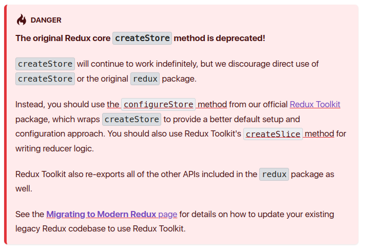

# State Management

---

# State Management

- Dengan menggunakan hooks `useReducer` kita bisa mengelola state di dalam aplikasi kita tanpa perlu menggunakan library tambahan.
- Namun hingga saat ini masih banyak aplikasi yang menggunakan library tambahan untuk mengelola state.
- Library yang paling populer adalah `redux`.
- Beberapa library lainnya adalah `redux-toolkit`, `recoil`, `mobx`, `zustand`, `effector`, dan lain-lain.

---

# Redux: Core Concept

- **State**: struktur data tunggal dan immutable yang mewakili seluruh state aplikasi Anda.

- **Action**: objek JavaScript biasa yang mewakili perubahan pada state, harus memiliki properti `type`.

- **Reducer**: fungsi murni yang mengambil state saat ini dan sebuah action sebagai argumen dan mengembalikan state baru.

> Berbeda dengan `useReducer`, `redux` mewajibkan properti `type` pada action.

---

# Redux: Step by Step

```bash
npm install redux
```

---

# Redux: Step by Step

- **Pembuatan Store**: Membuat store yang menyimpan state aplikasi Anda.
- **Dispatching Actions**: Memperbarui state dengan mendispatch actions.
- **Menangani Perubahan**: Menulis reducer untuk menentukan bagaimana state diperbarui ketika action di-dispatch.

---

# Typical Redux Project Structure

```
/my-redux-app
|-- /src
    |-- /actions
        |-- actionTypes.js
        |-- index.js
    |-- /components
        |-- /MyComponent
            |-- index.js
    |-- /reducers
        |-- index.js
        |-- myReducer.js
    |-- /store
        |-- index.js
    |-- /middleware
        |-- myMiddleware.js
    |-- index.js
    |-- App.js
```

---

# Redux: Store

```js
import { createStore } from 'redux'

const counterReducer(state = { count: 0 }, action) => {
  switch (action.type) {
    case 'INCREMENT':
      return {
        count: state.count + 1,
      }
    case 'DECREMENT':
      return {
        count: state.count - 1,
      }
    default:
      return state
  }
}

const store = createStore(counterReducer)
```

---



---

# Redux: UI

Untuk menggunakannya di dalam aplikasi React, kita perlu menginstall library `react-redux`.

```bash
npm install react-redux
```

---

# Redux: Provider

Untuk menyediakan akses store ke komponen-komponen di dalam aplikasi, kita perlu menambahkan `Provider` dan menyediakan store yang telah dibuat sebelumnya.

```js
import { Provider } from 'react-redux'
import store from './store'

const App = () => {
  return (
    <Provider store={store}>
      <Counter />
    </Provider>
  )
}
```

---

# Redux: Usage in Component

- Redux store diakses dengan menggunakan hooks.
- `useSelector` digunakan untuk mengakses state.
- `useDispatch` digunakan untuk mendispatch action.

```js
import { useSelector, useDispatch } from 'react-redux'

const Counter = () => {
  const count = useSelector((state) => state.count)
  const dispatch = useDispatch()
}
```

---

# Redux: Usage in Component

```js
import { useSelector, useDispatch } from 'react-redux'

const Counter = () => {
  const count = useSelector((state) => state.count)
  const dispatch = useDispatch()

  return (
    <div>
      <span>{count}</span>
      <button onClick={() => dispatch({ type: 'INCREMENT' })}>+</button>
      <button onClick={() => dispatch({ type: 'DECREMENT' })}>-</button>
    </div>
  )
}
```

---

# Redux Toolkit (RTK)

**Redux Toolkit (RTK)** adalah toolset untuk penggunaan Redux secara efisien. Toolset ini mempermudah tugas-tugas umum dalam implementasi Redux.

**Why Redux Toolkit?**

- Mempermudah pengaturan store.
- Mengurangi kode boilerplate.
- Menggabungkan praktik terbaik (best practices).

---

# Redux Toolkit (RTK)

```bash
npm install @reduxjs/toolkit
```

---

# Redux Toolkit (RTK)

Core features:

- `configureStore()`: menggabungkan beberapa konfigurasi Redux yang umum digunakan.

- `createSlice()` : membuat reducer dan action secara otomatis berdasarkan definisi object.

---

# Redux Toolkit (RTK)

```js
// counterSlice.js
import { createSlice } from '@reduxjs/toolkit'

const counterSlice = createslice({
  name: 'counter',
  initialState: { count: 0 },
  reducers: {
    increment: (state) => {
      state.count += 1
    },
    decrement: (state) => {
      state.count -= 1
    },
  },
})

export const { setCount, increment, decrement } = counterSlice.actions
export default counterSlice.reducer
```

---

# Redux Toolkit (RTK)

```js
// store.js
import { configureStore } from '@reduxjs/toolkit'
import counter from './counterSlice'

const store = configureStore({
  reducer: counter,
})
```

---

# Redux Toolkit (RTK)

```js
// Counter.js
import { useSelector, useDispatch } from 'react-redux'
import { increment, decrement } from './counterSlice'

const Counter = () => {
  const count = useSelector((state) => state.count)
  const dispatch = useDispatch()

  return (
    <div>
      <span>{count}</span>
      <button onClick={() => dispatch(increment())}>+</button>
      <button onClick={() => dispatch(decrement())}>-</button>
    </div>
  )
}
```
